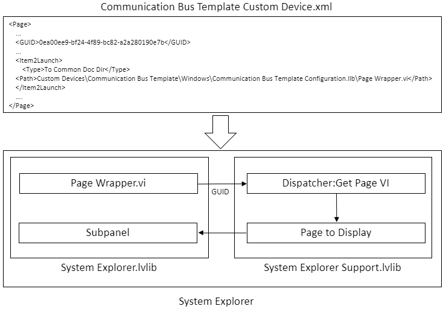

## Overview

The Communications Bus Template is intended to increase the rate at which new protocols can be implemented for use in VeriStand by providing a better starting point than the generic custom device templates.

To accomplish this, most of the custom device code is implemented through calls to G Interfaces defining the entry points a user will override to get the desired behavior.

The template engine is designed to encourage simply implementing the defined interfaces instead of designing and programming a complete `RT Driver.vi`.

The System Explorer code is almost entirely contained within LabVIEW packed project libraries, and implemented using G Interfaces and LabVIEW Classes. The code contained within the Custom Device project is primarily composed of wrappers that interface with the Custom Device XML and should not require frequent modification by the implementer of a specific bus protocol.

## File Layout

### Custom Device

The `Source/Custom Device` directory is primarily scaffolding for the interface between the custom device and VeriStand. This directory is intended to be low touch for users of the template. The dispatches to the G Interface implementations are called from both `System Explorer` and `Engine` libraries. Most template users should not need to modify anything in `Communication Bus Template Custom Device.lvproj` to implement the custom device. The exception would be to add automated tests for the custom device implementation.

### Custom Device Support

The majority of the custom device implementation lives in `Source/Custom Device Support`. Both the G Interfaces and concrete implementations of these interfaces live in this directory and are built `Communication Bus Template Support.lvproj`. Template developers should make every effort to keep code contained to the libraries included in this project instead of `Communication Bus Template Custom Device.lvproj`.

## Scripting API

All code interacting with the system definition through the LabVIEW Custom Device API, or the .NET API directly, should go through VIs contained in `Communication Bus Template Scripting.lvlib`. This library is the single source of truth for defining anything existing in the system definition XML. The exception to this rule is if the VeriStand API already provides a VI for doing exactly what is required, i.e. `NI VeriStand - Set Item Description.vi`.

This layer enables users to access the system definition from within System Explorer and directly through LabVIEW, while going through a single code path. If you are writing anything to the system definition through a VI not contained in this library, you're probably doing it incorrectly.

## System Explorer

System Explorer code should reside in `Communication Bus Template Support System Explorer.lvlib`. This includes implementations for all pages, right-click menus, and Action VIs. The System Explorer code from `Communication Bus Template System Explorer.lvlib` that is called by VeriStand dispatches the actual work to items in the support library through the interface described below.

This separation enables a user of the template to work in a single project to implement specific functionality while not having to touch the top-level custom device code.

### Interfaces

`System Explorer Dispatcher.lvclass` is the interface used by VIs in `Communication Bus Template System Explorer.lvlib` to call into the UI implementations in `Communication Bus Template Support System Explorer.lvlib`. Any new interaction required by the custom device defined in `Communication Bus Template Custom Device.xml` will require an interface method for the dispatcher.

Pages are loaded through the Dispatcher interface using `Get Page VI.vi`, as shown below. Right-click menus are populated in a similar way using `Get Menu Item.vi` and `Get Menu Items.vi`.

### Example Implementation

## Engine

Engine code should reside in `Source/Custom Device Support/Communication Bus Template Support Engine.lvlib`. The execution of the engine is defined by code pieces known as **Execution Units**. The Execution Unit interface, described below, enables the custom device engine code to remain static while enabling users to create completely custom code executing within the engine.

### Interfaces

#### Execution Unit

The **Execution Unit** is the fundamental piece of the engine in the template. The entry points for this interface are called from well-defined locations in `RT Driver.vi` so the top-level engine code does not require modification by the template user. The user can focus on just writing the code required for their bus protocol by implementing the interface methods.

All bus- and hardware-specific code should be written as implementations of the **Execution Unit** interface.

#### Execution Unit Factory

The **Execution Unit Factory** is the interface used for defining how to create the individual **Execution Units** to be consumed by the engine. It constructs the required **Execution Units** and is responsible for defnining which VeriStand channels are available to each **Execution Unit**.

### Example Implementation
