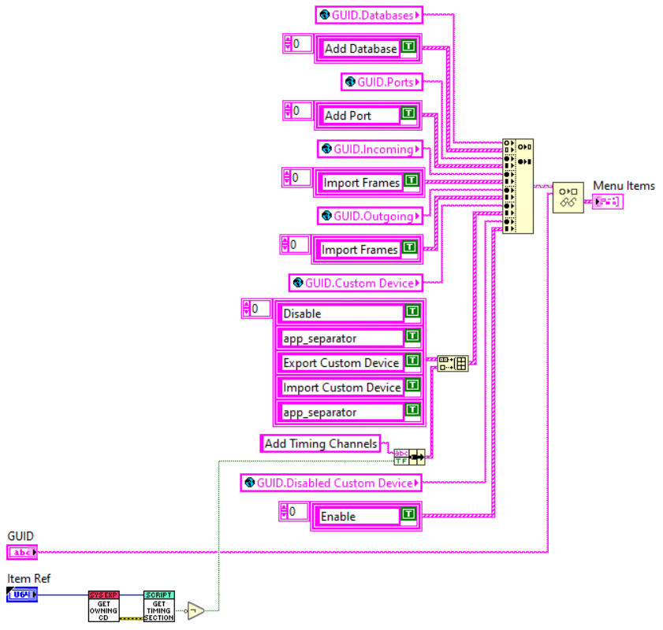
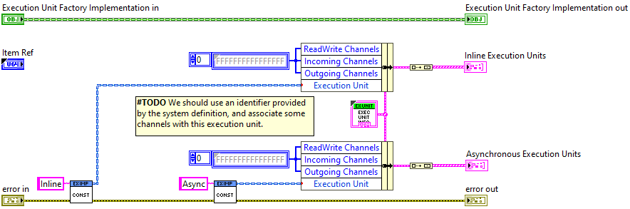

# VeriStand Communications Bus Template User Guide

The template provided in this repo is intended to be used for creating VeriStand custom devices that implement communication protocols. This guide aims to provide some theory on the template design details on how to use the template to create a fully functional custom device.

## Overview

The main goal of this template is to enable custom device authors to implement the configuration and messaging for a given protocol only once. The protocol and hardware configurations are implemented separately to more easily enable supporting multiple vendors or hardware devices in a new custom device without having to start everything from a blank custom device template.

Much of the overhead of creating custom devices is adapting LabVIEW code to correctly interface with VeriStand. The design of this template enables custom device authors to focus more on the code to implement a communication protocol and less on how VeriStand interacts with that code. The [Developer Guide](Developer%20Guide.md) provides more theory on the design of the template.

## Creating a New Custom Device

A utility for creating a new custom device from the template is located in this repo in the `Template Generator` directory. To generate a new custom device:

1. Open the VI at `Template Generator/Template Tool/Clone Template Main.vi`.
2. Follow the instructions on the VI's front panel to set the custom device name and output LabVIEW project location.
3. Navigate to the **Destination Directory** provided in the VI and explore the custom device project.

After the tool completes, the new custom device will be usable from VeriStand.

## Theory of Operation

The most flexible way of creating extensible architectures in LabVIEW is by using LabVIEW classes and interfaces. To create class or interface overrides, LabVIEW requires a new VI of the same name, with the same connector pane to exist. This presents challenges to creating extensible and reusable code pieces in custom devices because VeriStand requires top-level custom device libraries to be saved as `.llb` files. These files have a flat structure, which means two files of the same name can not exist in these file types.

The newly generated custom device has a different file structure than one generated from the [Custom Device Wizard](https://github.com/ni/niveristand-custom-device-wizard). Instead of a single LabVIEW project in the `Source` directory, there are two projects:

- Custom Device Project
- Support Project

### Custom Device Project

The `Source/Custom Device/<MyName> Custom Device.lvproj` primarily exists for historical reasons. This project contains the code and build specs required for interacting with VeriStand. It builds the `.llb` files that VeriStand requires for execution.

This project has the same structure as a project generated from the wizard, but contains minimal logic for performing work in the custom device. Most of the code is a set of wrappers that call code implemented in packed project libraries built from the support project. These libraries can be found in the `Includes` virtual folder in the project.

### Support Project

The `Source/Custom Device Support/<MyName> Support.lvproj` is the project where almost all logic for the custom device's behavior will exist. This project contains the logic for interacting with hardware, encoding/decoding bus messages, System Explorer pages, and database management. It builds packed project libraries (PPLs) in the form of `Engine.lvlibp` and `System Explorer.lvlibp` files, which support hierarchical file structures. These PPLs enable the custom device author to utilize classes and interfaces to implement extensible architectures. This strategy also promotes consistency of experience across custom devices.

### Execution Unit

The fundamental piece of the engine for custom devices using this template is the **Execution Unit**. The **Execution Unit** is a LabVIEW _Interface_ that a custom device author must implement in order to use this template. Using this interface enables the custom device author to focus almost entirely on only the code pieces necessary for implementing a specific protocol and communicating with a specific hardware device without having to think much about how it fits into VeriStand.

The **Execution Unit** interface and the process for implementing it are discussed throughout this guide. The methods for this interface are shown below.


## Developing a New Custom Device

### Scripting API

All code interacting with the system definition through the LabVIEW Custom Device API, or the .NET API directly, should go through VIs contained in `<MyName> Scripting.lvlib`. This library is the single source of truth for defining anything existing in the system definition XML. The exception to this rule is if the VeriStand API already provides a VI for doing exactly what is required, i.e. `NI VeriStand - Set Item Description.vi`.

This layer enables users to access the system definition from within System Explorer and directly through LabVIEW, while going through a single code path. If any code is touching the system definition through a VI not contained in this library, that functionality should be moved into this API.

### System Explorer

This template utilizes a dispatch pattern for retrieving pages and run-time menus to display in System Explorer. VI wrappers in the custom device project request page and run-time menu information from a **System Explorer Dispatcher** object and display them in System Explorer.

#### Dispatcher

The custom device XML specifies `Page Wrapper.vi` as the VI to execute when an item is selected in the tree. This VI delegates to page implementations in `<MyName> System Explorer.lvlibp` from the support project. To add pages, a new **Page**, with new GUID, needs to be added to the [custom device XML](https://www.ni.com/documentation/en/veristand/latest/manual/custom-device-xml/). The VI and GUID then must be added to `System Explorer Dispatcher.lvclass:Get Page.vi`.

```
<Page>
	<Name>
		<eng>Frame</eng>
		<loc>Frame</loc>
	</Name>
	<GUID>12b029fd-7aaa-4aa7-9f3a-279e0ce107c0</GUID>
	<Glyph>
		<Type>To Application Data Dir</Type>
		<Path>System Explorer\Glyphs\NI-XNET SignalFrame.png</Path>
	</Glyph>
	<Item2Launch>
		<Type>To Common Doc Dir</Type>
		<Path>Custom Devices\Communication Bus Template\Windows\Communication Bus Template Configuration.llb\Page Wrapper.vi</Path>
	</Item2Launch>
    .
    .
    .
</Page>
```


Similarly, any run-time menus should also use the **System Explorer Dispatcher** to dynamically create right-click menus for a page. `RunTimeMenu Wrapper.vi` asks the dispatcher which menu to display through `System Explorer Dispatcher.lvclass:Get Menu Item VI.vi` and what items to populate in that menu through `System Explorer Dispatcher:Get Menu Items.vi`.

```
<RunTimeMenu>
	<MenuItem>
		<GUID>4a264cda-93bf-4d77-92b0-38d997c67151</GUID>
		<Type>Custom</Type>
		<Name>
			<eng />
			<loc />
		</Name>
		<Item2Launch>
			<Type>To Common Doc Dir</Type>
			<Path>Custom Devices\Communication Bus Template\Windows\Communication Bus Template Configuration.llb\RunTimeMenu Wrapper.vi</Path>
		</Item2Launch>
		<CustomPopulation>
			<Type>To Common Doc Dir</Type>
			<Path>Custom Devices\Communication Bus Template\Windows\Communication Bus Template Configuration.llb\RunTimeMenu Custom Population.vi</Path>
		</CustomPopulation>
	</MenuItem>
</RunTimeMenu>
```



**Note:** Dynamic buttons at the top of the System Explorer window can not be added through the `Page Wrapper.vi` mechanism, so any pages requiring those buttons will require a standard page to be created.

### ActionVIOnCompile

This template makes use of the VeriStand [ActionVIOnCompile](https://www.ni.com/documentation/en/veristand/latest/manual/custom-device-action-vi-template/) to construct the **Execution Unit(s)** and associated channels required for executing the engine code.

`ActionVIOnCompile.vi` is responsible for taking all of the configuration in the system definition tree and converting those settings into a set of **Execution Units** that perform the communication bus message building and passing of those messages to the the bus, typically through a hardware driver.

`ActionVIOnCompile.vi` is designed to minimize the need to modify it. It is likely a custom device author will not touch this VI at all. Instead all of the work for the **Execution Unit** construction is delegated to the **Execution Unit Factory**.


#### Execution Unit Factory

The **Execution Unit Factory** uses a [factory pattern](https://en.wikipedia.org/wiki/Factory_method_pattern) to take the custom device configuration as an input and construct each of the **Execution Units** needed for running the engine code. By using the factory, the template code can handle passing all of the required information from the system definition to the engine upon deployment and the user only needs to focus on creating the individual **Execution Units** required for the application.



### Engine

The engine for this template is based on the _Inline Async Custom Device_ template generated by the [Custom Device Wizard](https://github.com/ni/niveristand-custom-device-wizard) and is a variation of the Inline Hardware Interface [custom device type](https://www.ni.com/documentation/en/veristand/latest/manual/custom-device-types/).

This template allows executing individual engine pieces in either inline or asynchronous processes. Each **Execution Unit** constructed in the **Execution Unit Factory** can be designated as inline or asynchronous depending on the requirements of the custom device and associated bus protocol and/or hardware device.

#### Execution Unit

The **Execution Unit** is the fundamental piece of code that executes in the custom device engine. This is where all logic for interacting with VeriStand channels and any hardware interfaces should be kept. It is defined as a LabVIEW _Interface_ with methods that mimic the states of the Inline Hardware Interface custom device type.

During initialization, the engine launches each **Execution Unit** either inlined with or asynchronous to the Primary Control Loop (PCL), based on the designation assigned by the **Execution Unit Factory**.

Once each **Execution Unit** is initialized, the interface methods are called in a deterministic order. For inline units, the method with a name matching the name of the current state in the engine state machine is called. For asynchronous units, the execution order is defined in `Execution Unit.Async.vi`.

##### Designing an Execution Unit

Generally, an **Execution Unit** will be defined by how the data for that unit is transmitted. Two important factors used for determining when to create a new **Execution Unit** are transmission frequency and direction. These are not the only factors, but analyzing these aspects of a communcation bus can help with **Execution Unit** design.

A typical communication bus will support both cyclic (continuous periodic) and acyclic data transmission. Cyclic data is continuously transmitted at a constant rate. Acyclic data is only transmitted when some event or trigger occurs. Because the frequency of these transmission types depends on different factors, often each of these message types will be defined by its own **Execution Unit**.

Similarly, the direction of transmission will typically have a different way of accessing the bus. For example, messages receieved from the bus into the custom device will generally call a different driver entry point than messages transmitted from the custom device to the bus. This scenario will usually necessitate different **Execution Units**.

As a good starting point, the base pool of **Execution Units** to begin with are below.

- Cyclic Transmit
- Cyclic Receive
- Acyclic Transmit
- Acyclic Receive

Not all of these will be needed for a given protocol, nor is a custom device limited to this list. The final design and number of **Execution Unit** classes is the responsibility of the custom device author and may be implemented by analyzing any number of factors specific to the bus.

The **Execution Unit** does not need to define whether it executes inline or asychronous to the PCL. That is determined by the **Execution Unit Factory**.

##### Implementing an Execution Unit

The **Execution Unit** interface defines the set of methods provided below. A description of the method's intent and when it is called in the inline case is also included. The timing of the method calls in the asynchronous case are defined in `Execution Unit.Async.vi`.

- **_Initialize_** - Set any hardware handles and initialize any data arrays that are required for using this **Execution Unit**. This method is called from `Initialize Inline Execution Units.vi` in the `RT Driver.vi` **Initialize** case after the **Shared Resources** have been initialized.
- **_Start_** - Send any start triggers or begin any required timers needed by the **Execution Unit**. This method is called from `Start Inline Execution Units.vi` in the `RT Driver.vi` **Start** case.
- **_Read from Hardware_** - Access any data on the bus incoming to the custom device. Perform any decoding or scaling of the data. The outputs of this method contain the channel data to be sent to VeriStand. This method is called from `Read from Inline Execution Units.vi` in the `RT Driver.vi` **Read Data from HW** case before the data values are written to VeriStand.
- **_Write to Hardware_** - Place any data from the custom device on the bus or write data to necessary registers on the hardware. Perform any scaling or encoding of the data before writing to the hardware. This method is called from `Write to Inline Execution Units.vi` in the `RT Driver.vi` **Write Data to HW** case.
- **_Finalize_** - Send any stop triggers or stop any timers needed by the **Execution Unit**. This method is called from `Finalize Inline Execution Units.vi.` in the `RT Driver.vi` **Close** case.
- **_Get Identifier_** - Return a unique identifier for the **Execution Unit**. This identifier may be useful for debugging or tracing execution when mulitple **Execution Units** are present in the system. This method is not called by default in the engine.

Some **Execution Units** may have empty implementations of some methods if they are not needed for that unit to perform its work.

#### Shared Resources

In some cases, common data items may be required by multiple **Execution Units**. Examples may include open hardware driver sessions or a log file reference. This template handles these cases by providing a **Shared Resources** interface and associated **Shared Resources Factory**.

**Shared Resources** are initialized before any **Execution Units** and are provided as inputs to the **Execution Unit** _Intialize_ method. If an **Execution Unit** needs access to these shared resources during execution, they should be stored in the class private data during initialization. The **Execution Unit** is not responsible for closing any references to these resources. The **Shared Resources** _Finalize_ method is called after every **Execution Unit** has called its _Finalize_ method and been shut down.
